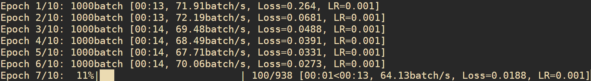
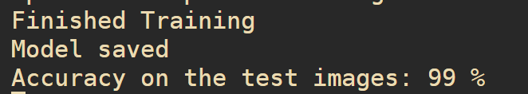
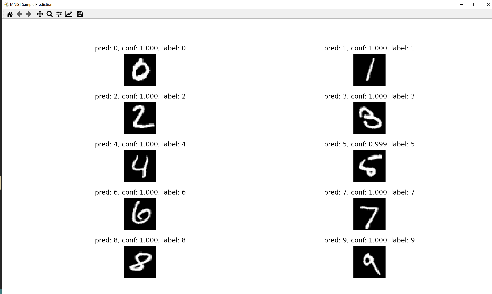
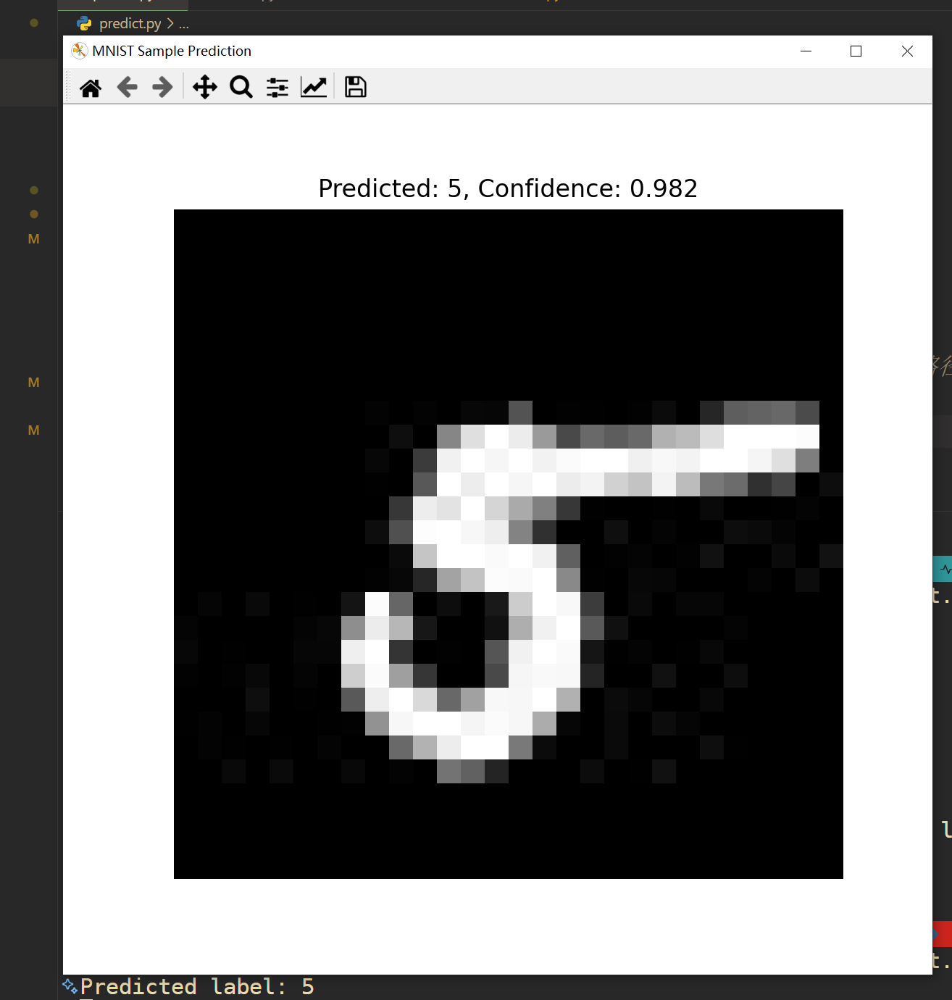

# LeNet-5

LeNet 识别手写数字基于 Pytorch 架构

Pytorch 官网 LeNet 文档指南 [https://pytorch.org/tutorials/beginner/introyt/introyt1_tutorial.html](https://pytorch.org/tutorials/beginner/introyt/introyt1_tutorial.html)

1. **安装依赖**

```
pip install -r requirements.txt
```

2. **运行 `train.py  `**

   ```python
   第一次运行时,需要将torchvision.datasets.MNIST的download参数设置为True,下载MNIST数据集。

   设置超参数
   epochs = 10     # 训练轮数
   lr = 0.001      # 学习率
   batch_size = 64 # 批处理大小

   设置训练完成后模型保存的路径
   save_model_path = "./model/LeNet.pth"
   ```
   **训练时每个 epoch 会输出 剩余时间、训练速度、loss 、学习率观测训练效果**

   
   输出模型精度：

   
3. 训练完成后可以选择是否展示效果(随机抽取照片展示)

   pred:预测结果
   conf:置信度
   label:实际标签

   ---

   
4. **运行 `visual.py` 可视化图片**
   因为原本的数据集以字节的形式储存,使用此 py 文件生成将 `数据集照片、测试集照片、train.txt、test.txt`,方便我们自己查看
5. **运行 `predict.py`**
   如果要使用测试集的照片需要先运行 `visual.py`,也可以自己提供照片(经测试效果较差)。
   首先需要进行如下设置

   ```python
   image_path="./data/MNIST/raw/test/1.jpg"  # 指定图像路径
   model_path="./model/LeNet.pth" # 指定模型路径
   ```
   控制台输出预测结果:

   
